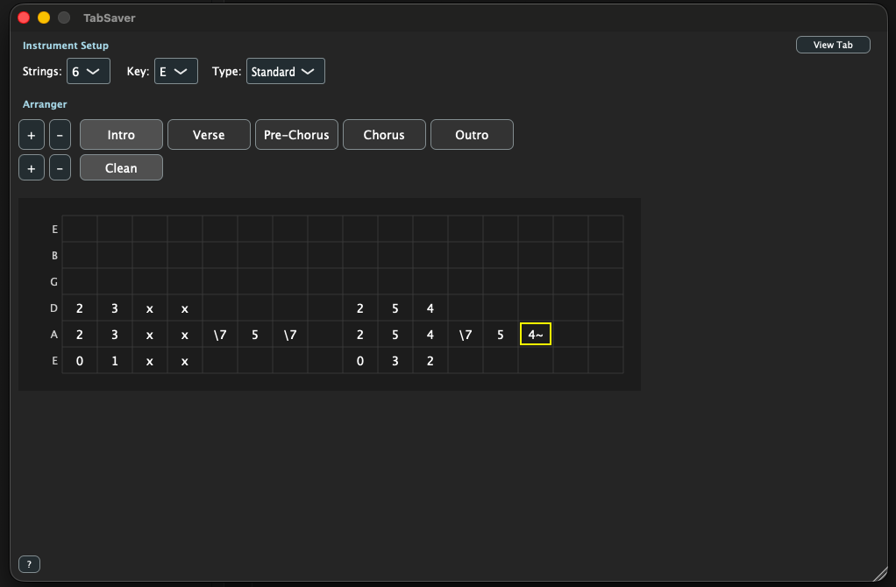
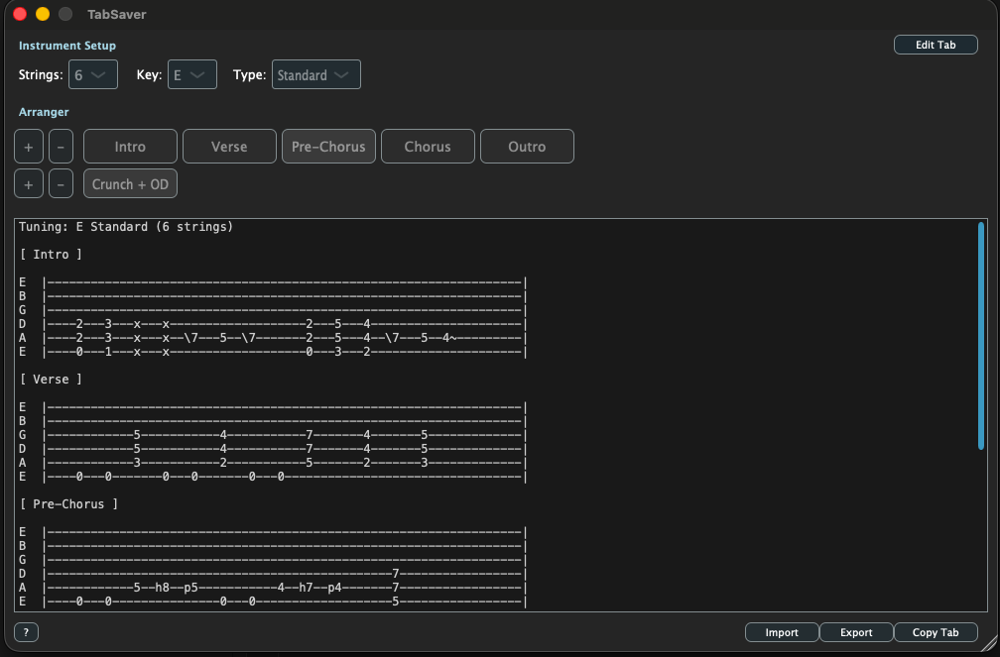

# TabSaver

A VST3 plugin for writing and editing guitar tablature directly within your DAW. Store your guitar tabs alongside your project for easy reference!

[](https://buymeacoffee.com/maotar)

## Screenshots





## Features

- **Visual Tab Editor**: Easy-to-use grid interface for writing tabs
- **Multiple Tunings**: Standard, Drop D, Drop C, 7-string, 8-string, and more
- **Keyboard Navigation**: Fast tab entry using number keys and arrow keys
- **DAW Integration**: Tab data automatically saves with your DAW project
- **Copy to Clipboard**: Quickly copy tabs as formatted text for sharing
- **Import/Export Files**: Save and load tabs as standalone files - perfect for transferring between projects or different DAWs

## Keyboard Shortcuts

- **0-9**: Enter fret number
- **Arrow Keys**: Navigate between strings and positions
- **Space**: Move to next column
- **Delete/Backspace**: Clear fret
- **+/=**: Insert column
- **Cmd+-**: Delete column

## Building the Plugin

### Prerequisites

#### macOS
1. **CMake** (3.15 or later)
   ```bash
   brew install cmake
   ```

2. **Xcode Command Line Tools**
   ```bash
   xcode-select --install
   ```

#### Windows
1. **CMake** (3.15 or later) - Download from [cmake.org](https://cmake.org/download/)
2. **Visual Studio 2019 or later** with C++ development tools

#### Linux
1. **CMake** and build tools:
   ```bash
   sudo apt-get update
   sudo apt-get install cmake build-essential
   ```

2. **JUCE dependencies**:
   ```bash
   sudo apt-get install libasound2-dev libjack-jackd2-dev \
     ladspa-sdk libcurl4-openssl-dev libfreetype6-dev \
     libx11-dev libxcomposite-dev libxcursor-dev libxext-dev \
     libxinerama-dev libxrandr-dev libxrender-dev \
     libwebkit2gtk-4.0-dev libglu1-mesa-dev mesa-common-dev
   ```

### Build Steps

1. Clone the repository:
   ```bash
   git clone https://github.com/maotar/TabSaver.git
   cd TabSaver
   ```

2. Create a build directory:
   ```bash
   mkdir build
   cd build
   ```

3. Generate build files:
   ```bash
   cmake ..
   ```

4. Build the plugin:
   ```bash
   cmake --build . --config Release
   ```

### Installation

#### macOS
Copy the plugin to your system plugin folder:

**VST3:**
```bash
cp -r build/TabSaver_artefacts/Release/VST3/TabSaver.vst3 ~/Library/Audio/Plug-Ins/VST3/
```

**AU:**
```bash
cp -r build/TabSaver_artefacts/Release/AU/TabSaver.component ~/Library/Audio/Plug-Ins/Components/
```

#### Windows
Copy the VST3 to your plugin folder:
```
copy build\TabSaver_artefacts\Release\VST3\TabSaver.vst3 "C:\Program Files\Common Files\VST3\"
```

Or use the standalone executable directly from:
```
build\TabSaver_artefacts\Release\Standalone\TabSaver.exe
```

#### Linux
Copy the VST3 to your plugin folder:
```bash
cp -r build/TabSaver_artefacts/Release/VST3/TabSaver.vst3 ~/.vst3/
```

Or run the standalone:
```bash
./build/TabSaver_artefacts/Release/Standalone/TabSaver
```

## Usage

### Basic Editing
1. Load the plugin in your DAW (as an instrument or MIDI FX)
2. Select your guitar tuning from the dropdown
3. Click on the editor to focus it
4. Use keyboard shortcuts to enter your tabs
5. Save your DAW project - tabs are automatically saved with it!

### Sharing and Transferring Tabs
- **Copy Tab**: Copies the current tab to clipboard as formatted text (great for sharing online or in notes)
- **Export**: Saves tab to a `.tab` file - useful for:
  - Backing up your tabs
  - Transferring tabs between different DAW projects
  - Moving tabs to a different DAW (e.g., from Ableton to Logic Pro)
  - Sharing tab files with other TabSaver users
- **Import**: Loads a previously exported `.tab` file

## Project Structure

```
tab_vst/
├── CMakeLists.txt           # Build configuration
├── README.md                # This file
└── Source/
    ├── PluginProcessor.h/cpp    # Main audio processor
    ├── PluginEditor.h/cpp       # Main UI window
    ├── TabEngine.h/cpp          # Tab data model
    └── TabEditorComponent.h/cpp # Grid editor widget
```

## Technical Details

- Built with JUCE 7.x
- Supports VST3, AU, and Standalone formats
- Stores tab data as XML in DAW project state
- Pure GUI plugin (no audio processing)

## License

This project is licensed under the GNU General Public License v3.0 - see the [LICENSE](LICENSE) file for details.
